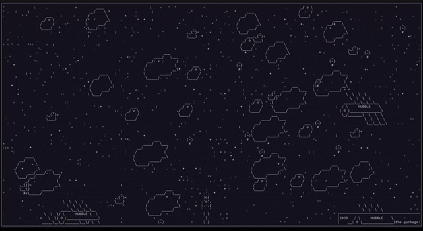

# Игра "Космическая Одиссея".

## Описание

Консольная игра про путешествие одинокого корабля по бескрайним глубинам космоса. Проследите мусорный след человечества
с эпохи космоса без мусора, до орбитальной свалки. Уворачивайтесь от все возрастающего количества космического мусора и
расчищайте себе путь при помощи плазменного оружия. Написана с нуля на чистом питоне без использования сторонних
библиотек.

## Управление

`↑` - движение вверх

`↓` - движение вниз

`→` - движение вправо

`←` - движение влево

`space` - сделать выстрел (Плазменная пушка разблокируется после 2020 года)

## Как запустить

- Для запуска игры вам понадобится Python третьей версии.
- Скачайте репозиторий с кодом и прилегающими файлами.
- Откройте терминал вашего компьютера.
- Запустите игру командой `python3 main.py`.