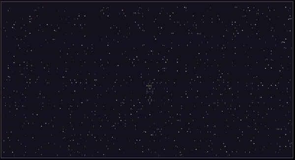

# Игра "Космическая Одиссея".

## Описание
Консольная игра про путешествие одинокого корабля по бескрайним глубинам космоса. Написана с нуля на чистом питоне без использования сторонних библиотек.

## Как запустить

- Для запуска игры вам понадобится Python третьей версии.
- Скачайте репозиторий с кодом и прилегающими файлами.
- Откройте терминал вашего компьютера.
- Запустите игру командой `python3 main.py`.